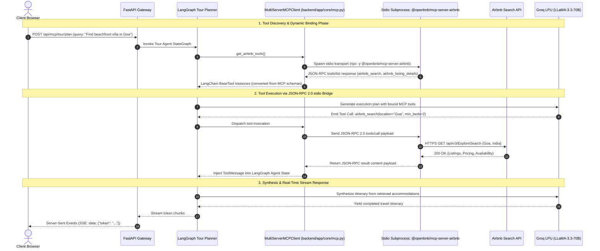
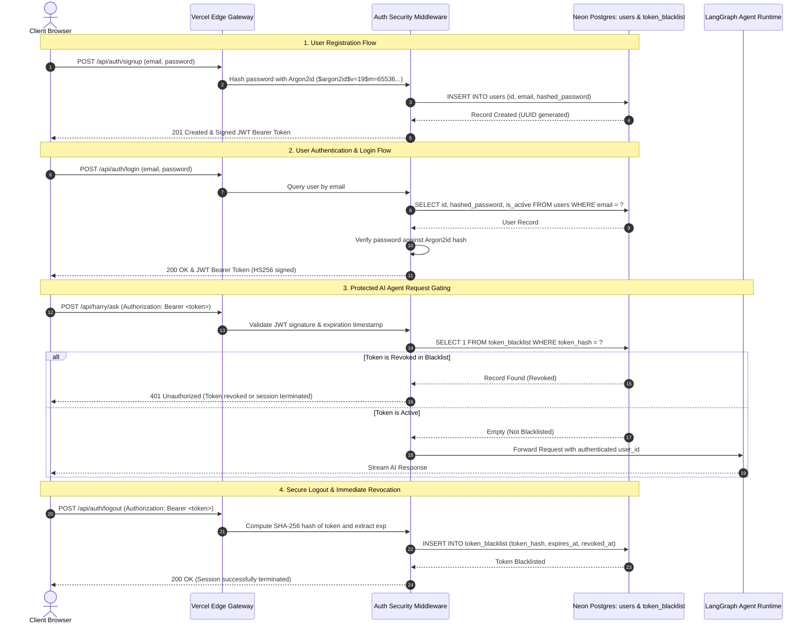
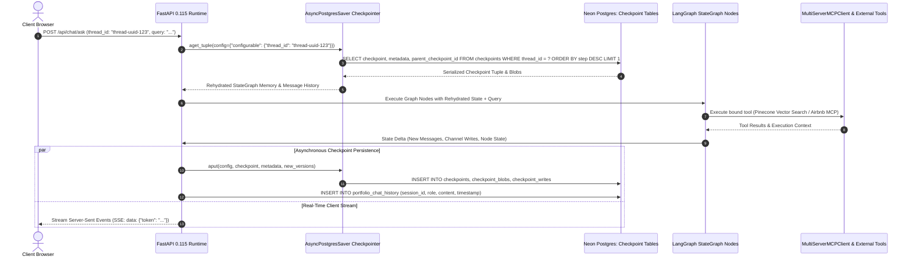

# ⚡ ambideXtrous · Autonomous AI Portfolio & Multi-Agent Intelligence Hub

<p align="center">
  
</p>

<p align="center">
  <a href="https://github.com/ambideXtrous9/portfolio-agent/actions"></a>
  <a href="https://vercel.com/"></a>
  <a href="https://fastapi.tiangolo.com"></a>
  <a href="https://python.org"></a>
  <a href="https://langchain-ai.github.io/langgraph/"></a>
  <a href="https://neon.tech/"></a>
  <a href="https://huggingface.co/ambideXtrous9/brand-logo-classifiers"></a>
  <a href="https://livekit.io/"></a>
  <a href="https://www.pinecone.io/"></a>
  <a href="https://jwt.io/"></a>
  <a href="https://modelcontextprotocol.io/"></a>
  <a href="https://docker.com"></a>
</p>

<p align="center">
  <b>A production-grade, decoupled Multi-Agent AI Platform featuring LangGraph StateGraphs, standalone Neon Serverless PostgreSQL persistence, dynamic Hugging Face Hub model checkpointing, multi-server Model Context Protocol (MCP), Pinecone vector retrieval, JWT authentication, and automated GitHub Actions CI/CD to Vercel Serverless.</b>
</p>

---

<div align="center">

### Live Production Deployments

| Resource | Service / Provider | URL / Identifier | Status |
| :--- | :--- | :--- | :--- |
| **Production Web App** | <a href="https://skillicons.dev"></a> Vercel Global Edge CDN | [`portfolio-agent-ai.vercel.app`](https://portfolio-agent-ai.vercel.app) | 🟢 `Online` |
| **API & OpenAPI Specs** | <a href="https://skillicons.dev"></a> FastAPI Serverless Gateway | [`/docs`](https://portfolio-agent-ai.vercel.app/docs) &bull; [`/redoc`](https://portfolio-agent-ai.vercel.app/redoc) | 🟢 `Public` |
| **CI/CD Automation** | <a href="https://skillicons.dev"></a> GitHub Actions Pipeline | [Automated Build & Deploy](https://github.com/ambideXtrous9/portfolio-agent/actions) | 🟢 `Passing` |
| **Managed Database** | <a href="https://skillicons.dev"></a> Neon Serverless Postgres | AWS `us-east-1` (`iad1`) &bull; Vercel Storage | 🟢 `Active` |
| **Model Context Protocol** | <a href="https://skillicons.dev"></a> MultiServerMCPClient | Stdio JSON-RPC &bull; Airbnb & Pinecone MCP Servers | 🟢 `Active` |
| **Model Checkpoint Hub** | Hugging Face Hub | [`ambideXtrous9/brand-logo-classifiers`](https://huggingface.co/ambideXtrous9/brand-logo-classifiers) | 🟢 `Synced` |
| **Voice Streaming Mesh** | LiveKit Cloud | WebRTC Real-Time SFU Mesh | 🟢 `Connected` |
| **Authentication Guard** | PyJWT + Argon2id Security Guard | Bearer Token Gating & Neon Blacklist | 🔒 `Enforced` |

</div>

---

## System Design & Architecture

<p align="center">
  <a href="https://skillicons.dev">
    
  </a>
</p>

<div align="center">
  <table style="border-collapse: collapse; border: none; width: 100%;">
    <tr>
      <td align="center" style="padding: 12px; border: 1px solid #30363d;">
        <b>Client & Edge Delivery</b><br/>
        <a href="https://skillicons.dev"></a><br/>
        <sub>Vercel Edge CDN &bull; HTML5/ES6 SPA</sub>
      </td>
      <td align="center" style="padding: 12px; border: 1px solid #30363d;">
        <b>Serverless API Gateway</b><br/>
        <a href="https://skillicons.dev"></a><br/>
        <sub>FastAPI 0.115 &bull; Python 3.12 Serverless</sub>
      </td>
      <td align="center" style="padding: 12px; border: 1px solid #30363d;">
        <b>Model Context Protocol (MCP)</b><br/>
        <a href="https://skillicons.dev"></a><br/>
        <sub>MultiServer MCP &bull; Node.js Stdio Bridges</sub>
      </td>
    </tr>
    <tr>
      <td align="center" style="padding: 12px; border: 1px solid #30363d;">
        <b>Cloud Persistence Tier</b><br/>
        <a href="https://skillicons.dev"></a><br/>
        <sub>Neon Serverless &bull; PgBouncer Pooler</sub>
      </td>
      <td align="center" style="padding: 12px; border: 1px solid #30363d;">
        <b>Deep Learning & Neural Vision</b><br/>
        <a href="https://skillicons.dev"></a><br/>
        <sub>PyTorch &bull; Hugging Face Hub Checkpoints</sub>
      </td>
      <td align="center" style="padding: 12px; border: 1px solid #30363d;">
        <b>DevOps & CI/CD Automation</b><br/>
        <a href="https://skillicons.dev"></a><br/>
        <sub>GitHub Actions &bull; Automated Deployment</sub>
      </td>
    </tr>
  </table>
</div>

### 1. End-to-End Distributed System Topology

The platform implements an asynchronous, distributed micro-architecture decoupled into six distinct operational tiers: an edge-delivered SPA, a serverless FastAPI gateway, a Model Context Protocol (MCP) subsystem, LangGraph multi-agent execution graphs, a standalone **Neon Serverless PostgreSQL** database with dual schemas, and external AI/cloud registries:

```mermaid
flowchart LR
    %% End-to-End Distributed System Architecture (Zero Emojis)

    subgraph Tier_CICD ["CI/CD Automation Pipeline"]
        direction TB
        Git_Repo["GitHub Source Repository\n(main branch)"]
        GHA_Runner["GitHub Actions CI Runner\n• Linting & Formatting\n• Pytest Integration Suite\n• uv.lock Dependency Audit"]
        Git_Repo -->|"git push / PR merge"| GHA_Runner
    end

    subgraph Tier_Vercel ["Vercel Edge & Serverless Gateway (AWS iad1)"]
        direction TB
        Edge_CDN["Global Edge CDN\n(Decoupled HTML5/ES6 SPA)"]
        FastAPI_App["FastAPI 0.115 ASGI Engine\n(Python 3.12 Serverless)"]
        Auth_Guard["Auth & Token Guard\n(PyJWT + Argon2id Gating)"]
        Lifespan_Loader["FastAPI Lifespan Manager\n(HF Dynamic Checkpoint Sync)"]
        Edge_CDN -.->|"HTTPS / JSON"| FastAPI_App
        FastAPI_App --> Auth_Guard
        FastAPI_App -.-> Lifespan_Loader
    end

    subgraph Tier_MCP ["Model Context Protocol (MCP) Subsystem"]
        direction TB
        MCP_Router["MultiServerMCPClient Manager\n(langchain_mcp_adapters.client)"]
        MCP_Airbnb["Airbnb MCP Server (stdio)\n(@openbnb/mcp-server-airbnb)"]
        MCP_Pinecone["Pinecone MCP Server (stdio)\n(@pinecone-database/mcp)"]
        MCP_Router <-->|"stdio JSON-RPC"| MCP_Airbnb
        MCP_Router <-->|"stdio JSON-RPC"| MCP_Pinecone
    end

    subgraph Tier_Agents ["LangGraph Multi-Agent Runtime"]
        direction TB
        StateGraph_Engine["LangGraph StateGraph Engine\n(State Serialization & Routing)"]
        Agent_Harry["Harry Potter Lore Scholar\n(Pinecone Vectors + Groq)"]
        Agent_Tour["MCP Tour & Stay Planner\n(Airbnb MCP Tools + Weather)"]
        Agent_Stock["Stock Quant & Screener\n(Breakout Detection & Models)"]
        Agent_Vision["Vision Studio Classifier\n(27-Brand PyTorch & YOLOv8)"]
        Agent_Voice["Voice AI Agent\n(LiveKit WebRTC Audio Mesh)"]
        StateGraph_Engine --> Agent_Harry & Agent_Tour & Agent_Stock & Agent_Vision & Agent_Voice
    end

    subgraph Tier_Postgres ["Neon Serverless Postgres Database (AWS iad1)"]
        direction TB
        Neon_PgBouncer["Neon PgBouncer Connection Pooler\n(psycopg_pool • prepare_threshold=None)"]
        subgraph Schema_Auth ["Auth & Identity Schema"]
            Table_Users[("users\n• id: UUID PK\n• email, hashed_password\n• created_at, is_active")]
            Table_Blacklist[("token_blacklist\n• token_hash: VARCHAR PK\n• expires_at, revoked_at")]
            Table_Resets[("password_resets\n• token_hash, expires_at")]
        end
        subgraph Schema_Checkpoints ["LangGraph Checkpointing Schema"]
            Table_Checkpoints[("checkpoints & checkpoint_blobs\n• thread_id, checkpoint_id\n• serialized StateGraph state")]
            Table_Writes[("checkpoint_writes\n• thread_id, task_id\n• pending graph channel writes")]
            Table_ChatHistory[("portfolio_chat_history\n• session_id, role, content\n• timestamped message log")]
        end
        Neon_PgBouncer --> Schema_Auth
        Neon_PgBouncer --> Schema_Checkpoints
    end

    subgraph Tier_Cloud ["External Cloud Registries & Infrastructure Mesh"]
        direction TB
        Cloud_HF[("Hugging Face Hub\nambideXtrous9/brand-logo-classifiers")]
        Cloud_Pinecone[("Pinecone Vector DB\nhpvdb-openai (8,970 vectors)")]
        Cloud_LiveKit[("LiveKit Cloud SFU Mesh\nBidirectional WebRTC Audio")]
        Cloud_Groq[("Groq LPU Inference\nLLaMA-3.3-70B-Versatile")]
    end

    %% Distributed System Interconnections
    GHA_Runner -->|"Automated Edge Deployment"| Tier_Vercel
    Auth_Guard <==>|"1. Verify Credentials & Check Blacklist"| Schema_Auth
    Auth_Guard -->|"2. Forward Authenticated Request"| StateGraph_Engine
    StateGraph_Engine <==>|"3. AsyncPostgresSaver Checkpointing"| Schema_Checkpoints
    Agent_Tour <==>|"Dynamic Tool Binding & Execution"| MCP_Router
    Agent_Harry <-->|"Semantic Vector Retrieval"| Cloud_Pinecone
    StateGraph_Engine <-->|"LLM Token Streaming"| Cloud_Groq
    Lifespan_Loader -.->|"Startup Weight Download"| Cloud_HF
    Agent_Voice <-->|"WebRTC Media Transport"| Cloud_LiveKit
```



---

### 2. Model Context Protocol (MCP) Architecture & Subsystem

The **Model Context Protocol (MCP)** is an open standard designed by Anthropic and adopted across industry frameworks that enables AI agents to securely interface with local and remote data sources, specialized tools, and external services via structured protocol exchanges.

In this architecture, MCP serves as the unified tool-calling abstraction layer in `backend/app/core/mcp.py`, eliminating bespoke API wrappers in favor of standard MCP servers:

<div align="center">
  <table style="border-collapse: collapse; border: none; width: 100%;">
    <tr>
      <td align="left" style="padding: 10px; border: 1px solid #30363d;">
        <a href="https://skillicons.dev"></a> <b>MultiServerMCPClient</b><br/>
        Orchestrated via <code>langchain_mcp_adapters.client.MultiServerMCPClient</code> as an asynchronous singleton. Manages sub-process lifecycles, JSON-RPC 2.0 framing, error recovery, and tool schema conversion into native LangChain <code>BaseTool</code> instances.
      </td>
      <td align="left" style="padding: 10px; border: 1px solid #30363d;">
        <a href="https://skillicons.dev"></a> <b>Airbnb MCP Server</b><br/>
        Spawned via Node.js stdio: <code>npx -y @openbnb/mcp-server-airbnb --ignore-robots-txt</code>. Provides real-time vacation rental lookups, pricing discovery, and coordinate mapping via <code>get_airbnb_tools()</code> to the Tour Planner agent.
      </td>
      <td align="left" style="padding: 10px; border: 1px solid #30363d;">
        <a href="https://skillicons.dev"></a> <b>Pinecone MCP Server</b><br/>
        Spawned via Node.js stdio: <code>npx -y @pinecone-database/mcp</code> with <code>PINECONE_API_KEY</code> injection. Exposes index introspection, vector records retrieval, and query tools via <code>get_pinecone_tools()</code>.
      </td>
    </tr>
  </table>
</div>

#### MCP Execution Sequence Diagram

The following sequence illustrates how the Tour Planner agent dynamically binds MCP tools, executes tool calls through standard input/output (stdio) pipes, and streams the synthesized result to the client:



---

### 3. Authentication & JWT Security Lifecycle with PostgreSQL

User authentication, identity verification, and token revocation are strictly enforced against **Neon PostgreSQL** via `backend/app/core/auth_db.py`:

* **Password Hashing with Argon2id**: Passwords are never stored in plaintext. They are hashed using Argon2id (`$argon2id$v=19$m=65536,t=3,p=4`), the password hashing competition winner offering high resistance against GPU/ASIC brute-force attacks.
* **Stateless Tokens with Stateful Revocation**: Tokens are signed with HMAC-SHA256 (`HS256`). When a user logs out, the SHA-256 hash of the token (`token_hash`) is immediately persisted into the `token_blacklist` table.
* **Guarded Request Interceptor**: All AI agent execution endpoints require a valid `Authorization: Bearer <token>` header. The middleware decodes the token, checks signature validity and expiration, and performs an indexed query on `token_blacklist` to guarantee that revoked sessions cannot execute agents.



---

### 4. LangGraph Multi-Agent State Checkpointing Flow

In a serverless environment like Vercel, compute lambdas are ephemeral and freeze or terminate between HTTP invocations. To ensure uninterrupted multi-turn conversations and long-running agent state, the runtime uses **LangGraph's `AsyncPostgresSaver`** integrated with **Neon Serverless PostgreSQL**:

1. **State Rehydration**: At the start of an agent turn, the engine queries the `checkpoints` table using `thread_id` to retrieve the latest graph state snapshot and blob history.
2. **Channel Writes & Branching**: Intermediate graph transitions are tracked in `checkpoint_writes` and `checkpoint_blobs` with transactional guarantees.
3. **Conversational Memory**: In parallel with graph state serialization, full chat messages are committed to `portfolio_chat_history`, maintaining a chronological log accessible by the user sidebar.
4. **PgBouncer Optimization**: Connection parameters set `prepare_threshold=None` in `psycopg_pool`, preventing prepared statement caching issues with Neon's PgBouncer transaction pooler.



---

### 5. Automated CI/CD & Delivery Pipeline (GitHub Actions → Vercel)

Every change committed to `main` undergoes automated testing and deployment:

```mermaid
flowchart LR
    subgraph DevWorkspace ["Developer Environment"]
        Dev["Local Commit & Push"]
    end

    subgraph GitHubActions ["GitHub Actions CI Pipeline"]
        direction TB
        Checkout["actions/checkout@v4"]
        SetupPython["actions/setup-python@v5\nPython 3.12"]
        VerifyDeps["Dependency Verification\nuv lock / pip check"]
        RunTests["Integration & Unit Tests\npytest backend/tests/"]
        TriggerDeploy["Deploy Webhook Trigger"]
        Checkout --> SetupPython --> VerifyDeps --> RunTests --> TriggerDeploy
    end

    subgraph VercelEdgeDeploy ["Vercel Production Deployment"]
        direction TB
        BuildLambda["Build Serverless Lambdas\nOptimize Python Bytecode"]
        SecretsInject["Inject Environment Secrets\nDATABASE_URL, HF_TOKEN, LIVEKIT"]
        DeployCDN["Publish Global Edge CDN\nportfolio-agent-ai.vercel.app"]
        BuildLambda --> SecretsInject --> DeployCDN
    end

    Dev -->|git push origin main| Checkout
    TriggerDeploy -->|Webhook Trigger| BuildLambda
```



---

### 6. Standalone Cloud Database Architecture: Neon Serverless Postgres

The PostgreSQL database hosting has been completely decoupled from the application container and is deployed as a **standalone managed cloud service on Neon Serverless Postgres**:

1. **Physical Location & Co-location**:
   - The database resides on **Neon Cloud** in AWS region `us-east-1` (`iad1`), provisioned directly via Vercel Storage integration (`portfolio-db`).
   - Co-locating the database with Vercel's primary serverless compute region ensures single-digit millisecond query latencies.

2. **Decoupled Service vs. Bundled Container**:
   - PostgreSQL is **not** hosted alongside the application container or bundled in serverless Lambdas.
   - User credentials, session tokens, and LangGraph multi-turn conversation states persist permanently across redeployments, branch previews, and cold starts.
   - Leverages Neon's autoscaling and instant scale-to-zero compute to optimize cloud resources.

3. **Connection Pooling & PgBouncer Compatibility**:
   - Interacts via `psycopg` (v3) and `psycopg_pool.AsyncConnectionPool` over encrypted TLS (`sslmode=require&channel_binding=require`).
   - Configured with `prepare_threshold=None` in async connection parameters to ensure seamless operation with Neon's PgBouncer transaction pooler, avoiding prepared statement collisions.

4. **Environment Variable Ingestion**:
   - Automatically ingests standard Vercel environment variables:
     - `DATABASE_URL` / `POSTGRES_URL`: Pooled connection string for transaction queries.
     - `DATABASE_URL_UNPOOLED` / `POSTGRES_URL_NON_POOLING`: Direct connection for schema migrations and table initialization.
     - `POSTGRES_HOST`, `POSTGRES_USER`, `POSTGRES_PASSWORD`, `POSTGRES_DATABASE`.

5. **Dual Persistence Abstractions**:
   - **Authentication Database (`auth_db_manager`)**:
     - Manages `users` table with Argon2id password hashing (`$argon2id$...`).
     - Manages `token_blacklist` for immediate cryptographic JWT invalidation on logout.
     - Manages `password_reset_tokens` with automatic time-based expiry.
   - **LangGraph Checkpoint & History Manager (`db_manager`)**:
     - Drives `AsyncPostgresSaver` to save agent graph execution state (`checkpoints`, `checkpoint_blobs`, `checkpoint_writes`, `checkpoint_migrations`).
     - Maintains conversational memory via `portfolio_chat_history` matching the `PostgresChatMessageHistory` interface.
   - **Resilient Fallback**: If running offline without database environment variables, the system automatically falls back to in-memory stores (`MemorySaver`) without crashing.

---

### 7. Technology Stack & Architectural Component Mapping

| Architectural Layer | Technologies & Skill-Icons | Implementation Role |
| :--- | :--- | :--- |
| **CI/CD & Delivery** | <a href="https://skillicons.dev"></a> | Automated linting, test suite execution, dependency locking (`uv.lock`), and Vercel edge deployment webhooks. |
| **Cloud Edge & Hosting** | <a href="https://skillicons.dev"></a> | Global edge CDN, zero-config TLS termination, serverless compute (AWS `iad1`), and Cloudflare tunneling. |
| **Gateway & Application** | <a href="https://skillicons.dev"></a> | FastAPI 0.115 async runtime, lifespan startup hooks, SSE token streaming, and Docker Compose orchestration. |
| **Model Context Protocol (MCP)** | <a href="https://skillicons.dev"></a> | `MultiServerMCPClient` orchestrating Node.js stdio servers (`@openbnb/mcp-server-airbnb`, `@pinecone-database/mcp`). |
| **Database & Persistence** | <a href="https://skillicons.dev"></a> &bull; **Neon Serverless** | Standalone Lakebase Postgres with PgBouncer connection pooling (`psycopg_pool`), Argon2id auth, and LangGraph checkpoints. |
| **Deep Learning & Models** | <a href="https://skillicons.dev"></a> &bull; **Hugging Face Hub** | Transfer Learning (Xception, InceptionV3, MobileNetV2, EfficientNet-B0), YOLOv8, and dynamic startup checkpoint download. |
| **Presentation Layer** | <a href="https://skillicons.dev"></a> | Decoupled SPA, Obsidian/Streamlit design system, WebSockets, SSE event handlers, and responsive CSS variables. |
| **Vector Search & RAG** | **Pinecone DB** &bull; **Neural Reranker** | 8,970 vector chunks in `hpvdb-openai` index with Cross-Encoder Neural Reranking for lore retrieval. |
| **Real-Time Voice Mesh** | **LiveKit Cloud** &bull; **WebRTC** | Full-duplex WebRTC audio streaming, Silero Voice Activity Detection (VAD), and Groq Whisper STT. |

---

## 🧩 Key AI Features & Capabilities

| Feature | Tech Stack | Description |
| :--- | :--- | :--- |
| **🪄 Harry Potter Lore Scholar** | LangGraph, Pinecone (`hpvdb-openai`), Groq | RAG agent querying 8,970 vector chunks with comparative Indian Epics synthesis and dedicated session history. |
| **🏡 MCP Tour Planner** | LangGraph, Airbnb MCP Server, Open-Meteo | Live Airbnb stay rate lookup and 3-day weather forecasts streamed token-by-token via Server-Sent Events (SSE). |
| **🐘 Neon Checkpointing & Auth** | LangGraph `AsyncPostgresSaver`, Neon Postgres | Real-time thread state serialization, persistent multi-turn memory, and Argon2id session authentication. |
| **🤗 HF Dynamic Checkpoints** | Hugging Face Hub, `huggingface_hub` | Dynamic lifespan startup synchronization of deep learning weights (.ckpt, .pt) keeping repo lightweight. |
| **🛡️ JWT Authentication Guard** | FastAPI, PyJWT, Argon2id | Strict authentication gating on all AI agent endpoints; public access limited strictly to Home. |
| **📈 Stock Screener & Valuation** | Pandas, Technical Analysis, Valuation Models | 20-DMA volume breakout scanner across Nifty 500/Microcap 250 with automated institutional research reports. |
| **👁️ Vision AI & YOLO Detection** | PyTorch, YOLOv8, Timm | 27-brand corporate logo neural classification with real-time bounding-box coordinates overlay. |
| **🐙 2D Clustering Sandbox** | Scikit-Learn, Plotly.js | Interactive 2D spatial canvas with real-time K-Means, DBSCAN, and Silhouette Coefficient evaluation. |
| **🎙️ Voice AI Agent** | LiveKit WebRTC, Groq Whisper, Silero VAD | Low-latency full-duplex conversational voice agent with live audio waveform visualization. |

---


## 📡 Core API Specification

| Domain | Method | Endpoint | Auth | Description |
| :--- | :---: | :--- | :---: | :--- |
| **System** | `GET` | `/api/system/health` | Public | System status and checkpointer mode. |
| **Auth** | `POST` | `/api/auth/signup` | Public | Register new user account. |
| **Auth** | `POST` | `/api/auth/login` | Public | Authenticate and issue JWT Bearer token. |
| **Auth** | `GET` | `/api/auth/me` | 🔒 Bearer | Fetch authenticated user profile. |
| **Auth** | `POST` | `/api/auth/logout` | 🔒 Bearer | Revoke token and add to PostgreSQL blacklist. |
| **Chat** | `GET` | `/api/chat/threads/{id}/history` | 🔒 Bearer | Retrieve thread chat history. |
| **Chat** | `DELETE`| `/api/chat/threads/{id}` | 🔒 Bearer | Delete thread history and checkpoints. |
| **Harry Potter** | `POST` | `/api/harry/ask` | 🔒 Bearer | Lore query with Pinecone retrieval. |
| **Harry Potter** | `GET` | `/api/harry/ask/stream` | 🔒 Bearer | Real-time SSE token stream. |
| **Tour Planner** | `POST` | `/api/tour/plan` | 🔒 Bearer | Airbnb accommodations and travel plan. |
| **Tour Planner** | `GET` | `/api/tour/stream` | 🔒 Bearer | Real-time SSE streaming with MCP tools. |
| **Stock Screener** | `POST` | `/api/stock/scan` | 🔒 Bearer | Volume breakout equity scanner. |
| **Stock Screener** | `GET` | `/api/stock/report` | 🔒 Bearer | Institutional valuation report. |
| **Vision Studio** | `POST` | `/api/vision/classify` | 🔒 Bearer | 27-brand logo classification. |
| **Vision Studio** | `POST` | `/api/vision/yolo` | 🔒 Bearer | YOLO logo bounding box detection. |
| **Clustering** | `POST` | `/api/cluster/run` | 🔒 Bearer | K-Means & DBSCAN with Silhouette scores. |
| **Voice Agent** | `GET` | `/api/voice/status` | 🔒 Bearer | LiveKit room tokens and agent readiness. |

---

## 🚀 Quickstart

### Option A: Docker Compose (Full Stack)

```bash
git clone https://github.com/ambideXtrous9/portfolio-agent.git
cd portfolio-agent
cp .env.example .env

docker compose up -d --build
```

* **Frontend**: `http://localhost:3000`
* **FastAPI Backend**: `http://localhost:8000`
* **API Docs**: `http://localhost:8000/docs`
* **Database**: Standalone Neon Serverless Postgres (`DATABASE_URL` in `.env`)

---

### Option B: Local Python Development

```bash
python3 -m venv .venv
source .venv/bin/activate
pip install -r requirements.txt
cp .env.example .env

python run.py
```

---

## 🧪 Integration Verification

Run the end-to-end integration test suite verifying authentication gating, PostgreSQL checkpointing, session isolation, and token blacklisting:

```bash
python3 backend/tests/test_postgres_auth.py
```

> **Result**: 11/11 tests passing (Health, 401 Unauthorized Gating, Signup, Login, Profile, Bearer Auth, Query Token, Chat History, Logout & Revocation).

---

## 📂 Repository Layout

```
portfolio-agent/
├── backend/
│   ├── app/
│   │   ├── main.py                     # FastAPI application & lifespan management
│   │   ├── config.py                   # Pydantic Settings
│   │   ├── core/                       # Auth, DB, LLM factory, MCP client
│   │   ├── schemas/                    # Pydantic validation models
│   │   └── api/endpoints/              # Auth-guarded feature endpoints
│   └── tests/test_postgres_auth.py     # Integration test suite
├── frontend/
│   ├── index.html                      # SPA interface with dedicated chat sidebars
│   ├── css/style.css                   # Streamlit & Obsidian design system
│   ├── js/                             # Authenticated API client & agent view modules
│   └── assets/images/                  # Hero banner, graphs, diagrams
├── docker-compose.yml                  # 3-tier production stack
└── run.py                              # Local dev runner
```

---

## 📄 License & Author

Distributed under the **MIT License**.

* **Author**: Sushovan Saha ([@ambideXtrous9](https://github.com/ambideXtrous9))
* **Repository**: [github.com/ambideXtrous9/portfolio-agent](https://github.com/ambideXtrous9/portfolio-agent)
