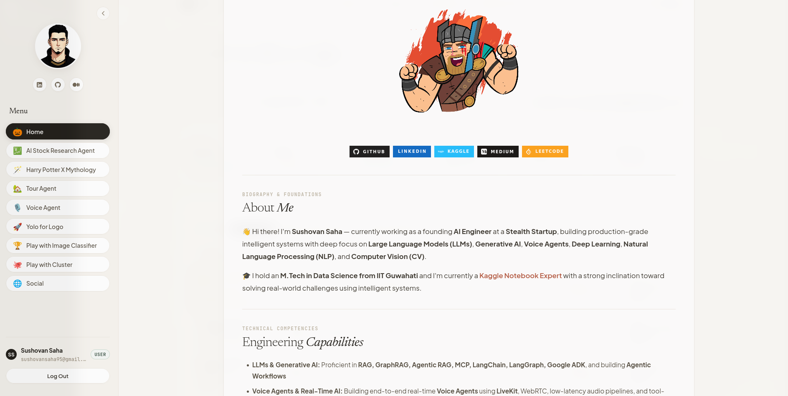
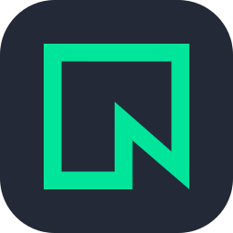
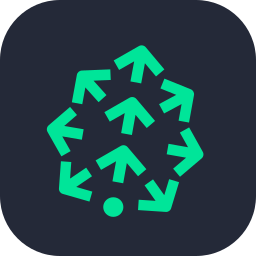
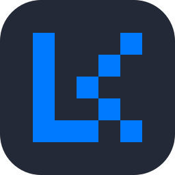
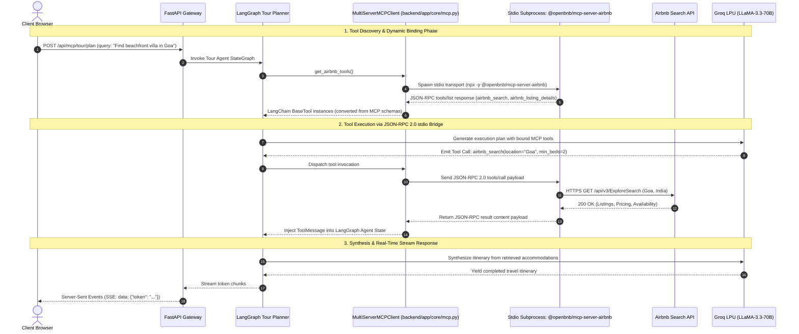
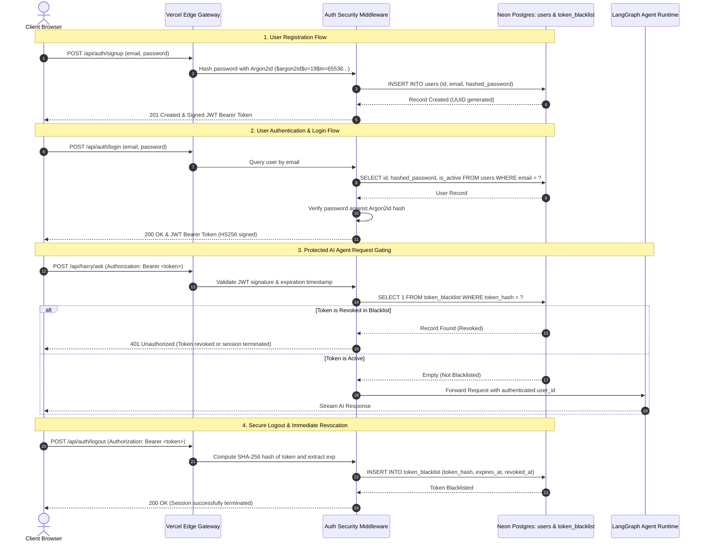
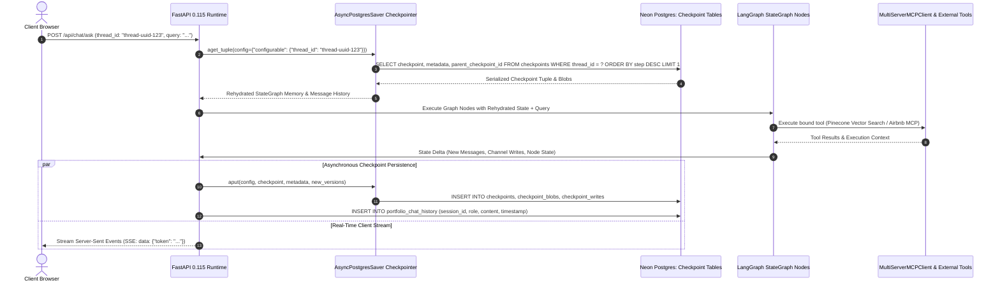
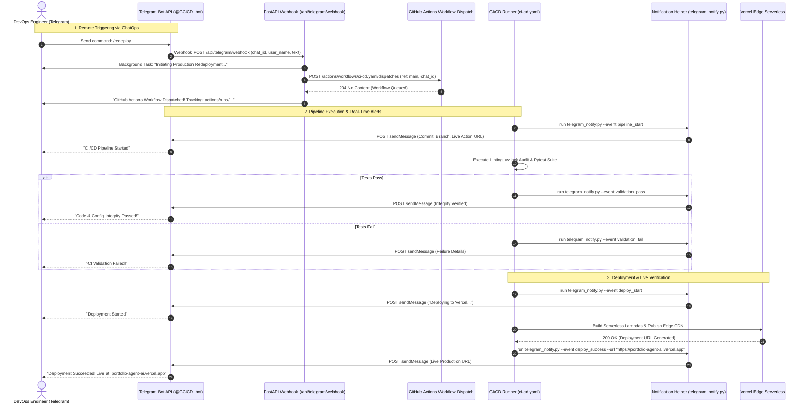

# ⚡ ambideXtrous · Autonomous AI Portfolio & Multi-Agent Intelligence Hub

<p align="center">
  
</p>

<p align="center">
  <a href="https://github.com/ambideXtrous9/portfolio-agent/actions"></a>
  <a href="https://t.me/GCICD_bot"></a>
  <a href="https://vercel.com/"></a>
  <a href="https://fastapi.tiangolo.com"></a>
  <a href="https://python.org"></a>
  <a href="https://langchain-ai.github.io/langgraph/"></a>
  <a href="https://neon.tech/"></a>
  <a href="https://huggingface.co/ambideXtrous9/brand-logo-classifiers"></a>
  <a href="https://livekit.io/"></a>
  <a href="https://www.pinecone.io/"></a>
  <a href="https://jwt.io/"></a>
  <a href="https://modelcontextprotocol.io/"></a>
  <a href="https://docker.com"></a>
</p>

<p align="center">
  <b>A production-grade, decoupled Multi-Agent AI Platform featuring LangGraph StateGraphs, standalone Neon Serverless PostgreSQL persistence, dynamic Hugging Face Hub model checkpointing, multi-server Model Context Protocol (MCP), Pinecone vector retrieval, JWT authentication, bidirectional Telegram CI/CD ChatOps, and automated GitHub Actions to Vercel Serverless.</b>
</p>

---

<div align="center">

### Live Production Deployments

| Resource | Service / Provider | URL / Identifier | Status |
| :--- | :--- | :--- | :--- |
| **Production Web App** | <a href="https://skillicons.dev"></a> Vercel Global Edge CDN | [`portfolio-agent-ai.vercel.app`](https://portfolio-agent-ai.vercel.app) | 🟢 `Online` |
| **API & OpenAPI Specs** | <a href="https://skillicons.dev"></a> FastAPI Serverless Gateway | [`/docs`](https://portfolio-agent-ai.vercel.app/docs) &bull; [`/redoc`](https://portfolio-agent-ai.vercel.app/redoc) | 🟢 `Public` |
| **CI/CD Automation** | <a href="https://skillicons.dev"></a> GitHub Actions Pipeline | [Automated Build & Deploy](https://github.com/ambideXtrous9/portfolio-agent/actions) | 🟢 `Passing` |
| **Telegram ChatOps Bot** | <a href="https://t.me/GCICD_bot"></a> Telegram CI/CD Bot | [`@GCICD_bot`](https://t.me/GCICD_bot) &bull; `/redeploy`, `/status`, `/health` | 🟢 `Active` |
| **Managed Database** | <a href="https://neon.tech"></a> Neon Serverless Postgres | AWS `us-east-1` (`iad1`) &bull; Vercel Storage | 🟢 `Active` |
| **Model Context Protocol** | <a href="https://skillicons.dev"></a> MultiServerMCPClient | Stdio JSON-RPC &bull; Airbnb & Pinecone MCP Servers | 🟢 `Active` |
| **Vector Database** | <a href="https://www.pinecone.io/"></a> Pinecone Vector DB | `hpvdb-openai` index &bull; 8,970 embeddings | 🟢 `Indexed` |
| **Model Checkpoint Hub** | <a href="https://huggingface.co/ambideXtrous9/brand-logo-classifiers"></a> Hugging Face Hub | [`ambideXtrous9/brand-logo-classifiers`](https://huggingface.co/ambideXtrous9/brand-logo-classifiers) | 🟢 `Synced` |
| **Voice Streaming Mesh** | <a href="https://livekit.io/"></a> LiveKit Cloud | WebRTC Real-Time SFU Mesh | 🟢 `Connected` |
| **Authentication Guard** | <a href="https://jwt.io/"></a> PyJWT + Argon2id | Bearer Token Gating & Neon Blacklist | 🔒 `Enforced` |

</div>

---

## System Design & Architecture

<p align="center">
  <a href="https://skillicons.dev">
    
  </a>
</p>
<p align="center">
  <a href="https://neon.tech"></a>
  <a href="https://huggingface.co/ambideXtrous9/brand-logo-classifiers"></a>
  <a href="https://www.pinecone.io/"></a>
  <a href="https://livekit.io/"></a>
  <a href="https://webrtc.org"></a>
  <a href="https://t.me/GCICD_bot"></a>
  <a href="https://langchain-ai.github.io/langgraph/"></a>
  <a href="https://langchain.com"></a>
  <a href="https://jwt.io/"></a>
</p>

<div align="center">
  <table style="border-collapse: collapse; border: none; width: 100%;">
    <tr>
      <td align="center" style="padding: 12px; border: 1px solid #30363d;">
        <b>Client & Edge Delivery</b><br/>
        <a href="https://skillicons.dev"></a>
        <a href="https://jwt.io/"></a><br/>
        <sub>Vercel Edge CDN &bull; HTML5/ES6 SPA</sub>
      </td>
      <td align="center" style="padding: 12px; border: 1px solid #30363d;">
        <b>Serverless API Gateway</b><br/>
        <a href="https://skillicons.dev"></a><br/>
        <sub>FastAPI 0.115 &bull; Python 3.12 Serverless</sub>
      </td>
      <td align="center" style="padding: 12px; border: 1px solid #30363d;">
        <b>Model Context Protocol (MCP)</b><br/>
        <a href="https://skillicons.dev"></a>
        <a href="https://www.pinecone.io/"></a><br/>
        <sub>MultiServer MCP &bull; Node.js Stdio Bridges</sub>
      </td>
    </tr>
    <tr>
      <td align="center" style="padding: 12px; border: 1px solid #30363d;">
        <b>Cloud Persistence Tier</b><br/>
        <a href="https://skillicons.dev"></a>
        <a href="https://neon.tech"></a>
        <a href="https://langchain-ai.github.io/langgraph/"></a><br/>
        <sub>Neon Serverless &bull; PgBouncer Pooler</sub>
      </td>
      <td align="center" style="padding: 12px; border: 1px solid #30363d;">
        <b>Deep Learning & Neural Vision</b><br/>
        <a href="https://skillicons.dev"></a>
        <a href="https://huggingface.co/ambideXtrous9/brand-logo-classifiers"></a><br/>
        <sub>PyTorch &bull; Hugging Face Hub Checkpoints</sub>
      </td>
      <td align="center" style="padding: 12px; border: 1px solid #30363d;">
        <b>CI/CD & Telegram ChatOps</b><br/>
        <a href="https://skillicons.dev"></a>
        <a href="https://t.me/GCICD_bot"></a><br/>
        <sub>GitHub Actions &bull; Telegram @GCICD_bot</sub>
      </td>
    </tr>
  </table>
</div>

### 1. End-to-End Distributed System Topology

The platform implements an asynchronous, distributed micro-architecture decoupled into operational tiers: an edge-delivered SPA, a serverless FastAPI gateway, an automated Telegram ChatOps control loop, a Model Context Protocol (MCP) subsystem, LangGraph multi-agent execution graphs, a standalone **Neon Serverless PostgreSQL** database with dual schemas, and external AI/cloud registries:

```mermaid
flowchart LR
    %% End-to-End Distributed System Architecture (Zero Emojis)

    subgraph Tier_ChatOps ["Telegram ChatOps & Remote CI/CD Control"]
        direction TB
        Dev_Client["DevOps Engineer / User\n(Telegram Client App)"]
        Telegram_API["Telegram Bot Gateway\n(@GCICD_bot API)"]
        Dev_Client <-->|"/redeploy, /status, /health"| Telegram_API
    end

    subgraph Tier_CICD ["CI/CD Automation Pipeline"]
        direction TB
        Git_Repo["GitHub Source Repository\n(main branch)"]
        GHA_Runner["GitHub Actions CI Runner\n• Linting & Syntax Validation\n• Pytest Integration Suite\n• uv.lock Dependency Audit"]
        Git_Repo -->|"git push / PR merge"| GHA_Runner
    end

    subgraph Tier_Vercel ["Vercel Edge & Serverless Gateway (AWS iad1)"]
        direction TB
        Edge_CDN["Global Edge CDN\n(Decoupled HTML5/ES6 SPA)"]
        FastAPI_App["FastAPI 0.115 ASGI Engine\n(Python 3.12 Serverless)"]
        Telegram_Handler["Telegram Webhook Route\n(/api/telegram/webhook)"]
        Auth_Guard["Auth & Token Guard\n(PyJWT + Argon2id Gating)"]
        Lifespan_Loader["FastAPI Lifespan Manager\n(HF Dynamic Checkpoint Sync)"]
        Edge_CDN -.->|"HTTPS / JSON"| FastAPI_App
        FastAPI_App --> Telegram_Handler
        FastAPI_App --> Auth_Guard
        FastAPI_App -.-> Lifespan_Loader
    end

    subgraph Tier_MCP ["Model Context Protocol (MCP) Subsystem"]
        direction TB
        MCP_Router["MultiServerMCPClient Manager\n(langchain_mcp_adapters.client)"]
        MCP_Airbnb["Airbnb MCP Server (stdio)\n(@openbnb/mcp-server-airbnb)"]
        MCP_Pinecone["Pinecone MCP Server (stdio)\n(@pinecone-database/mcp)"]
        MCP_Router <-->|"stdio JSON-RPC"| MCP_Airbnb
        MCP_Router <-->|"stdio JSON-RPC"| MCP_Pinecone
    end

    subgraph Tier_Agents ["LangGraph Multi-Agent Runtime"]
        direction TB
        StateGraph_Engine["LangGraph StateGraph Engine\n(State Serialization & Routing)"]
        Agent_Harry["Harry Potter Lore Scholar\n(Pinecone Vectors + Groq)"]
        Agent_Tour["MCP Tour & Stay Planner\n(Airbnb MCP Tools + Weather)"]
        Agent_Stock["Stock Quant & Screener\n(Breakout Detection & Models)"]
        Agent_Vision["Vision Studio Classifier\n(27-Brand PyTorch & YOLOv8)"]
        Agent_Voice["Voice AI Agent\n(LiveKit WebRTC Audio Mesh)"]
        StateGraph_Engine --> Agent_Harry & Agent_Tour & Agent_Stock & Agent_Vision & Agent_Voice
    end

    subgraph Tier_Postgres ["Neon Serverless Postgres Database (AWS iad1)"]
        direction TB
        Neon_PgBouncer["Neon PgBouncer Connection Pooler\n(psycopg_pool • prepare_threshold=None)"]
        subgraph Schema_Auth ["Auth & Identity Schema"]
            Table_Users[("users\n• id: UUID PK\n• email, hashed_password\n• created_at, is_active")]
            Table_Blacklist[("token_blacklist\n• token_hash: VARCHAR PK\n• expires_at, revoked_at")]
            Table_Resets[("password_resets\n• token_hash, expires_at")]
        end
        subgraph Schema_Checkpoints ["LangGraph Checkpointing Schema"]
            Table_Checkpoints[("checkpoints & checkpoint_blobs\n• thread_id, checkpoint_id\n• serialized StateGraph state")]
            Table_Writes[("checkpoint_writes\n• thread_id, task_id\n• pending graph channel writes")]
            Table_ChatHistory[("portfolio_chat_history\n• session_id, role, content\n• timestamped message log")]
        end
        Neon_PgBouncer --> Schema_Auth
        Neon_PgBouncer --> Schema_Checkpoints
    end

    subgraph Tier_Cloud ["External Cloud Registries & Infrastructure Mesh"]
        direction TB
        Cloud_HF[("Hugging Face Hub\nambideXtrous9/brand-logo-classifiers")]
        Cloud_Pinecone[("Pinecone Vector DB\nhpvdb-openai (8,970 vectors)")]
        Cloud_LiveKit[("LiveKit Cloud SFU Mesh\nBidirectional WebRTC Audio")]
        Cloud_Groq[("Groq LPU Inference\nLLaMA-3.3-70B-Versatile")]
    end

    %% Distributed System Interconnections & Telegram Control Loop
    Telegram_API <==>|"1. Webhook Updates & Status Queries"| Telegram_Handler
    Telegram_Handler -->|"2. Trigger workflow_dispatch API"| GHA_Runner
    GHA_Runner -.->|"3. Real-Time Pipeline Progress Alerts (telegram_notify.py)"| Telegram_API
    GHA_Runner -->|"Automated Edge Deployment"| Tier_Vercel
    Auth_Guard <==>|"Verify Credentials & Check Blacklist"| Schema_Auth
    Auth_Guard -->|"Forward Authenticated Request"| StateGraph_Engine
    StateGraph_Engine <==>|"AsyncPostgresSaver Checkpointing"| Schema_Checkpoints
    Agent_Tour <==>|"Dynamic Tool Binding & Execution"| MCP_Router
    Agent_Harry <-->|"Semantic Vector Retrieval"| Cloud_Pinecone
    StateGraph_Engine <-->|"LLM Token Streaming"| Cloud_Groq
    Lifespan_Loader -.->|"Startup Weight Download"| Cloud_HF
    Agent_Voice <-->|"WebRTC Media Transport"| Cloud_LiveKit
```



---

### 2. Model Context Protocol (MCP) Subsystem

MCP acts as the standardized tool-calling abstraction layer in `backend/app/core/mcp.py`, replacing bespoke API integrations with decoupled stdio protocol bridges:

| Subsystem Component | Transport & Runtime | Capabilities & Tool Binding |
| :--- | :--- | :--- |
| <a href="https://skillicons.dev"></a> **MultiServerMCPClient** | In-process Async Client (`MultiServerMCPClient`) | Manages subprocess lifecycles, JSON-RPC 2.0 framing, and converts MCP schemas into native LangChain `BaseTool` instances. |
| <a href="https://skillicons.dev"></a> **Airbnb MCP Server** | Node.js stdio (`@openbnb/mcp-server-airbnb`) | Real-time vacation rental lookups, pricing discovery, and coordinate mapping via `get_airbnb_tools()`. |
| <a href="https://www.pinecone.io"></a> **Pinecone MCP Server** | Node.js stdio (`@pinecone-database/mcp`) | Vector index introspection, record fetching, and hybrid search via `get_pinecone_tools()`. |

#### MCP Tool Discovery & Execution Flow



---

### 3. Authentication & JWT Security Lifecycle (Neon Postgres)

Identity verification and token invalidation are enforced at the API gateway via `backend/app/core/auth_db.py`:

* **Argon2id Password Hashing**: Passwords stored as `$argon2id$v=19$m=65536,t=3,p=4` hashes (memory-hard, ASIC/GPU brute-force proof).
* **Stateless JWT + Stateful Revocation**: HS256-signed bearer tokens paired with immediate `token_blacklist` table writes on logout.
* **Gateway Request Guard**: Middleware validates signatures, expiration, and queries `token_blacklist` before allowing agent execution.



---

### 4. LangGraph Multi-Agent State Checkpointing

To sustain multi-turn conversational agents across ephemeral serverless invocations, graph state is serialized to Neon Postgres using `AsyncPostgresSaver`:

* **State Rehydration**: Loads graph snapshots from `checkpoints` and `checkpoint_blobs` indexed by `thread_id`.
* **Atomic Channel Writes**: Persists intermediate node transitions to `checkpoint_writes` with transactional rollback safety.
* **Conversational Memory**: Commits message logs to `portfolio_chat_history` for sidebar UI rehydration.
* **PgBouncer Pooling**: Configures `prepare_threshold=None` in `psycopg_pool` to avoid prepared statement collisions.



---

### 5. Telegram ChatOps & CI/CD Control Loop

A bidirectional ChatOps control loop connecting Telegram (`@GCICD_bot`), FastAPI (`backend/app/api/endpoints/telegram.py`), and GitHub Actions (`backend/scripts/telegram_notify.py`):

* **Remote CI/CD Dispatch**: `/redeploy` or `/deploy` triggers GitHub Actions `workflow_dispatch` with caller metadata.
* **Real-Time Step Notifications**: `telegram_notify.py` streams HTML alerts for `pipeline_start`, `validation_pass/fail`, `deploy_start`, and `deploy_success`.
* **Live Operational Probes**: `/status`, `/health`, and `/info` probe API endpoints, Groq LPU, Pinecone MCP, and LiveKit Cloud SFU.

#### Telegram ChatOps & CI/CD Execution Sequence Diagram



---

### 6. Automated CI/CD & Delivery Pipeline (GitHub Actions → Vercel)

Every change committed to `main` (or triggered via Telegram `/redeploy`) undergoes automated testing and deployment:

```mermaid
flowchart LR
    subgraph DevWorkspace ["Developer Environment"]
        Dev["Local Commit & Push"]
    end

    subgraph TelegramChatOps ["Telegram Remote Trigger"]
        AdminUser["DevOps Admin"]
        TGBot["@GCICD_bot (/redeploy)"]
        AdminUser -->|Command| TGBot
    end

    subgraph GitHubActions ["GitHub Actions CI Pipeline"]
        direction TB
        Checkout["actions/checkout@v4"]
        SetupPython["actions/setup-python@v5\nPython 3.12"]
        VerifyDeps["Dependency Verification\nuv lock / pip check"]
        RunTests["Integration & Unit Tests\npytest backend/tests/"]
        TG_Alerts["Telegram Pipeline Alerts\n(telegram_notify.py)"]
        DeployTrigger["Deploy Webhook Trigger"]
        Checkout --> SetupPython --> VerifyDeps --> RunTests --> TG_Alerts --> DeployTrigger
    end

    subgraph VercelEdgeDeploy ["Vercel Production Deployment"]
        direction TB
        BuildLambda["Build Serverless Lambdas\nOptimize Python Bytecode"]
        SecretsInject["Inject Environment Secrets\nDATABASE_URL, HF_TOKEN, LIVEKIT"]
        DeployCDN["Publish Global Edge CDN\nportfolio-agent-ai.vercel.app"]
        BuildLambda --> SecretsInject --> DeployCDN
    end

    Dev -->|git push origin main| Checkout
    TGBot -->|workflow_dispatch| Checkout
    DeployTrigger -->|Webhook Trigger| BuildLambda
```



---

### 7. Standalone Cloud Database: Neon Serverless Postgres

PostgreSQL is completely decoupled from the application container and runs as a managed serverless instance on **Neon Cloud**:

| Architectural Tier | Configuration & Schema | Role & Capabilities |
| :--- | :--- | :--- |
| **Cloud Co-Location** | AWS `us-east-1` (`iad1`) via Vercel Storage | Low-latency co-location with serverless edge compute; persistent storage across redeployments. |
| **Connection Pooling** | `psycopg_pool.AsyncConnectionPool` (`prepare_threshold=None`) | High-concurrency async pooling compatible with Neon PgBouncer transaction mode. |
| **Auth Schema** | `users`, `token_blacklist`, `password_resets` | Argon2id credential storage, instant JWT invalidation, and session tracking. |
| **Checkpoint Schema** | `checkpoints`, `checkpoint_blobs`, `checkpoint_writes` | Full graph serialization for LangGraph multi-turn session persistence. |
| **Conversational Memory** | `portfolio_chat_history` | Chronological session history synced for user chat sidebars. |
| **Resilience & Fallback** | Automatic fallback to `MemorySaver` | Seamless local development and zero-crash operation when offline. |

---

### 8. Technology Stack & Architectural Component Mapping

| Architectural Layer | Technologies & Icons | Implementation Role |
| :--- | :--- | :--- |
| **CI/CD & ChatOps** | <a href="https://skillicons.dev"></a> <a href="https://t.me/GCICD_bot"></a> | Automated linting, test suite execution, dependency locking (`uv.lock`), Vercel edge deployment webhooks, and bidirectional Telegram ChatOps control (`@GCICD_bot`). |
| **Cloud Edge & Hosting** | <a href="https://skillicons.dev"></a> | Global edge CDN, zero-config TLS termination, serverless compute (AWS `iad1`), and Cloudflare tunneling. |
| **Gateway & Application** | <a href="https://skillicons.dev"></a> | FastAPI 0.115 async runtime, lifespan startup hooks, SSE token streaming, and Docker Compose orchestration. |
| **Model Context Protocol (MCP)** | <a href="https://skillicons.dev"></a> | `MultiServerMCPClient` orchestrating Node.js stdio servers (`@openbnb/mcp-server-airbnb`, `@pinecone-database/mcp`). |
| **Database & Persistence** | <a href="https://skillicons.dev"></a> <a href="https://neon.tech"></a> <a href="https://langchain-ai.github.io/langgraph/"></a> | Standalone Lakebase Postgres with PgBouncer connection pooling (`psycopg_pool`), Argon2id auth, and LangGraph checkpoints (`AsyncPostgresSaver`). |
| **Auth & Security** | <a href="https://jwt.io/"></a> <a href="https://neon.tech"></a> | Cryptographic Argon2id password hashing, stateless JWT Bearer token generation, and Neon blacklist token invalidation table. |
| **Deep Learning & Models** | <a href="https://skillicons.dev"></a> <a href="https://huggingface.co/ambideXtrous9/brand-logo-classifiers"></a> | Transfer Learning (Xception, InceptionV3, MobileNetV2, EfficientNet-B0), YOLOv8, and dynamic startup checkpoint download. |
| **Presentation Layer** | <a href="https://skillicons.dev"></a> | Decoupled SPA, Obsidian/Streamlit design system, WebSockets, SSE event handlers, and responsive CSS variables. |
| **Vector Search & RAG** | <a href="https://www.pinecone.io"></a> <a href="https://langchain.com"></a> | 8,970 vector chunks in `hpvdb-openai` index with Cross-Encoder Neural Reranking for lore retrieval. |
| **Real-Time Voice Mesh** | <a href="https://livekit.io"></a> <a href="https://webrtc.org"></a> | Full-duplex WebRTC audio streaming, Silero Voice Activity Detection (VAD), and Groq Whisper STT. |

---

## Key AI Features & Capabilities

| Feature | Tech Stack & Icons | Description |
| :--- | :--- | :--- |
| **Harry Potter Lore Scholar** |  LangGraph, Pinecone (`hpvdb-openai`), Groq | RAG agent querying 8,970 vector chunks with comparative Indian Epics synthesis and dedicated session history. |
| **MCP Tour Planner** | <a href="https://skillicons.dev"></a> LangGraph, Airbnb MCP Server, Open-Meteo | Live Airbnb stay rate lookup and 3-day weather forecasts streamed token-by-token via Server-Sent Events (SSE). |
| **Neon Checkpointing & Auth** |   LangGraph `AsyncPostgresSaver`, Neon Postgres | Real-time thread state serialization, persistent multi-turn memory, and Argon2id session authentication. |
| **HF Dynamic Checkpoints** |  Hugging Face Hub, `huggingface_hub` | Dynamic lifespan startup synchronization of deep learning weights (.ckpt, .pt) keeping repo lightweight. |
| **JWT Authentication Guard** |  FastAPI, PyJWT, Argon2id | Strict authentication gating on all AI agent endpoints; public access limited strictly to Home. |
| **Stock Screener & Valuation** | <a href="https://skillicons.dev"></a> Pandas, Technical Analysis, Valuation Models | 20-DMA volume breakout scanner across Nifty 500/Microcap 250 with automated institutional research reports. |
| **Vision AI & YOLO Detection** | <a href="https://skillicons.dev"></a> PyTorch, YOLOv8, Timm | 27-brand corporate logo neural classification with real-time bounding-box coordinates overlay. |
| **2D Clustering Sandbox** | <a href="https://skillicons.dev"></a> Scikit-Learn, Plotly.js | Interactive 2D spatial canvas with real-time K-Means, DBSCAN, and Silhouette Coefficient evaluation. |
| **Voice AI Agent** |   LiveKit WebRTC, Groq Whisper, Silero VAD | Low-latency full-duplex conversational voice agent with live audio waveform visualization. |

---


## 📡 Core API Specification

| Domain | Method | Endpoint | Auth | Description |
| :--- | :---: | :--- | :---: | :--- |
| **System** | `GET` | `/api/system/health` | Public | System status and checkpointer mode. |
| **Auth** | `POST` | `/api/auth/signup` | Public | Register new user account. |
| **Auth** | `POST` | `/api/auth/login` | Public | Authenticate and issue JWT Bearer token. |
| **Auth** | `GET` | `/api/auth/me` | 🔒 Bearer | Fetch authenticated user profile. |
| **Auth** | `POST` | `/api/auth/logout` | 🔒 Bearer | Revoke token and add to PostgreSQL blacklist. |
| **Chat** | `GET` | `/api/chat/threads/{id}/history` | 🔒 Bearer | Retrieve thread chat history. |
| **Chat** | `DELETE`| `/api/chat/threads/{id}` | 🔒 Bearer | Delete thread history and checkpoints. |
| **Harry Potter** | `POST` | `/api/harry/ask` | 🔒 Bearer | Lore query with Pinecone retrieval. |
| **Harry Potter** | `GET` | `/api/harry/ask/stream` | 🔒 Bearer | Real-time SSE token stream. |
| **Tour Planner** | `POST` | `/api/tour/plan` | 🔒 Bearer | Airbnb accommodations and travel plan. |
| **Tour Planner** | `GET` | `/api/tour/stream` | 🔒 Bearer | Real-time SSE streaming with MCP tools. |
| **Stock Screener** | `POST` | `/api/stock/scan` | 🔒 Bearer | Volume breakout equity scanner. |
| **Stock Screener** | `GET` | `/api/stock/report` | 🔒 Bearer | Institutional valuation report. |
| **Vision Studio** | `POST` | `/api/vision/classify` | 🔒 Bearer | 27-brand logo classification. |
| **Vision Studio** | `POST` | `/api/vision/yolo` | 🔒 Bearer | YOLO logo bounding box detection. |
| **Clustering** | `POST` | `/api/cluster/run` | 🔒 Bearer | K-Means & DBSCAN with Silhouette scores. |
| **Voice Agent** | `GET` | `/api/voice/status` | 🔒 Bearer | LiveKit room tokens and agent readiness. |

---

## 🚀 Quickstart

### Option A: Docker Compose (Full Stack)

```bash
git clone https://github.com/ambideXtrous9/portfolio-agent.git
cd portfolio-agent
cp .env.example .env

docker compose up -d --build
```

* **Frontend**: `http://localhost:3000`
* **FastAPI Backend**: `http://localhost:8000`
* **API Docs**: `http://localhost:8000/docs`
* **Database**: Standalone Neon Serverless Postgres (`DATABASE_URL` in `.env`)

---

### Option B: Local Python Development

```bash
python3 -m venv .venv
source .venv/bin/activate
pip install -r requirements.txt
cp .env.example .env

python run.py
```

---

## 🧪 Integration Verification

Run the end-to-end integration test suite verifying authentication gating, PostgreSQL checkpointing, session isolation, and token blacklisting:

```bash
python3 backend/tests/test_postgres_auth.py
```

> **Result**: 11/11 tests passing (Health, 401 Unauthorized Gating, Signup, Login, Profile, Bearer Auth, Query Token, Chat History, Logout & Revocation).

---

## 📂 Repository Layout

```
portfolio-agent/
├── backend/
│   ├── app/
│   │   ├── main.py                     # FastAPI application & lifespan management
│   │   ├── config.py                   # Pydantic Settings
│   │   ├── core/                       # Auth, DB, LLM factory, MCP client
│   │   ├── schemas/                    # Pydantic validation models
│   │   └── api/endpoints/              # Auth-guarded feature endpoints
│   └── tests/test_postgres_auth.py     # Integration test suite
├── frontend/
│   ├── index.html                      # SPA interface with dedicated chat sidebars
│   ├── css/style.css                   # Streamlit & Obsidian design system
│   ├── js/                             # Authenticated API client & agent view modules
│   └── assets/images/                  # Hero banner, graphs, diagrams
├── docker-compose.yml                  # 3-tier production stack
└── run.py                              # Local dev runner
```

---

## 📄 License & Author

Distributed under the **MIT License**.

* **Author**: Sushovan Saha ([@ambideXtrous9](https://github.com/ambideXtrous9))
* **Repository**: [github.com/ambideXtrous9/portfolio-agent](https://github.com/ambideXtrous9/portfolio-agent)
