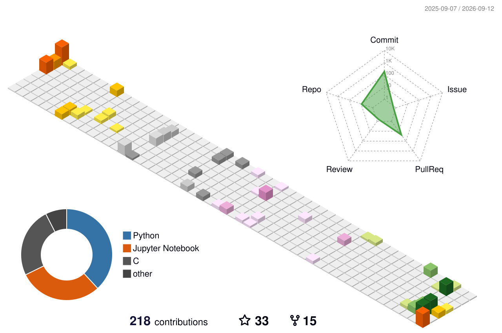
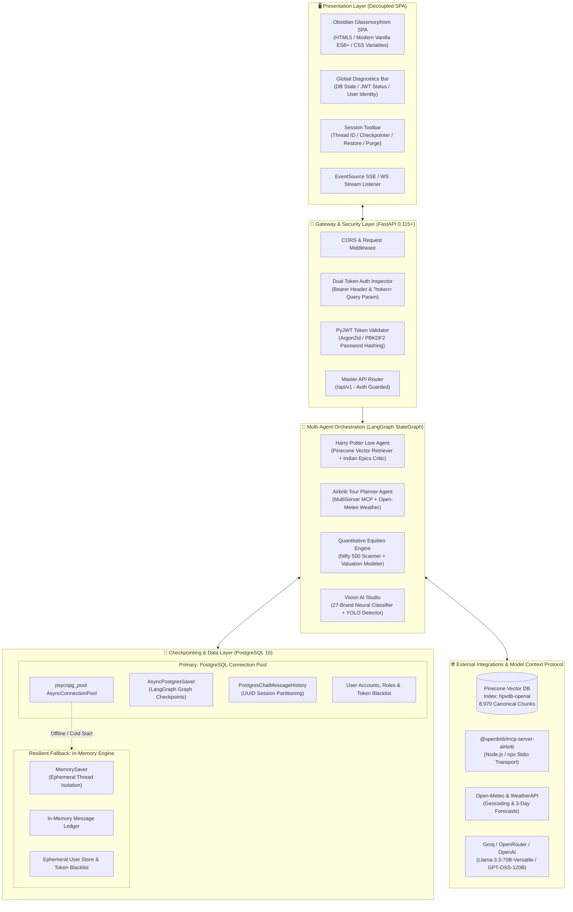
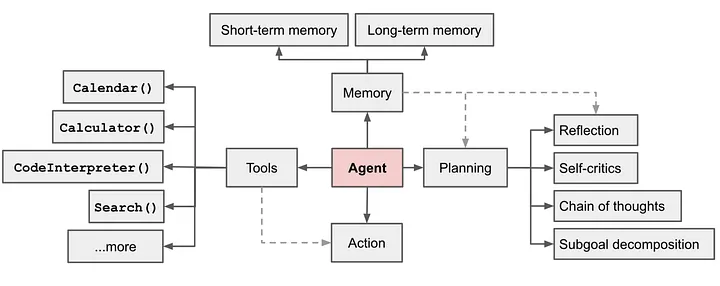
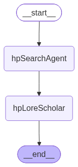
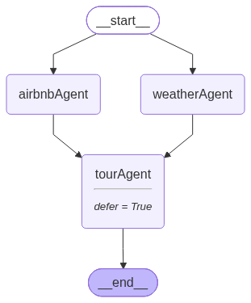
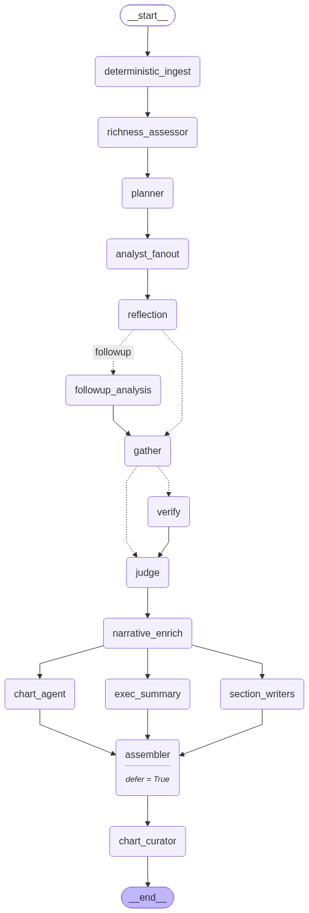
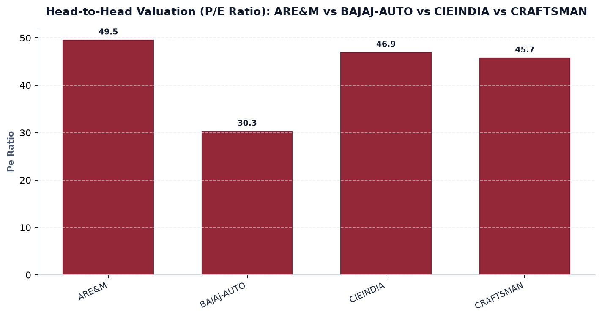
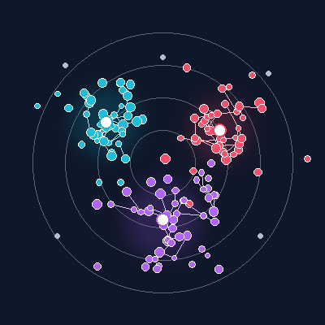
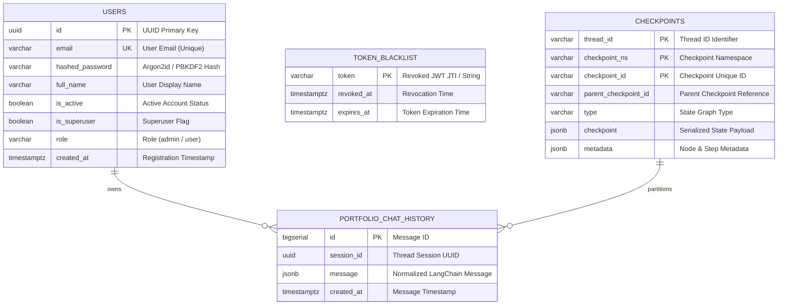

# ⚡ ambideXtrous · Autonomous AI Portfolio & Multi-Agent Intelligence Hub

<p align="center">
  
</p>

<p align="center">
  <a href="https://fastapi.tiangolo.com"></a>
  <a href="https://python.org"></a>
  <a href="https://langchain-ai.github.io/langgraph/"></a>
  <a href="https://www.postgresql.org/"></a>
  <a href="https://www.pinecone.io/"></a>
  <a href="https://jwt.io/"></a>
  <a href="https://modelcontextprotocol.io/"></a>
  <a href="https://docker.com"></a>
  <a href="https://opensource.org/licenses/MIT"></a>
</p>

<p align="center">
  <b>A production-grade, fully decoupled Multi-Agent AI Platform featuring LangGraph StateGraphs, PostgreSQL state checkpointing, multi-server Model Context Protocol (MCP), Pinecone vector retrieval, JWT authentication, quantitative equity research, computer vision, and real-time streaming interfaces.</b>
</p>

---

<div align="center">

### 🌐 Live Deployments & Demo Access

| Resource | Link / Access Key | Status |
| :--- | :--- | :--- |
| **Live Production Web App** | [`portfolio-agent-ai.vercel.app`](https://portfolio-agent-ai.vercel.app) | 🟢 `Online` |
| **Interactive OpenAPI Docs (Swagger)** | [`/docs`](https://portfolio-agent-ai.vercel.app/docs) | 🟢 `Public` |
| **Alternative API Specs (ReDoc)** | [`/redoc`](https://portfolio-agent-ai.vercel.app/redoc) | 🟢 `Public` |
| **Authentication Guard** | Sign In or Register via modal | 🔒 `Strictly Enforced` |
| **Active Feature Pull Request** | [PR #2: feat/postgres-auth-checkpoints](https://github.com/ambideXtrous9/portfolio-agent/pull/2) | 🚀 `All Checks Passing` |

</div>

---

## 📑 Table of Contents

- [⚡ System Architecture Overview](#-system-architecture-overview)
- [🧩 Core Intelligent Modules](#-core-intelligent-modules)
  - [1. 🪄 Harry Potter Lore Scholar Agent](#1--harry-potter-lore-scholar-agent)
  - [2. 🏡 Tour Planner Multi-Server MCP Agent](#2--tour-planner-multi-server-mcp-agent)
  - [3. 💾 PostgreSQL Checkpointing & Thread Persistence](#3--postgresql-checkpointing--thread-persistence)
  - [4. 🛡️ Enterprise JWT Authentication & RBAC Guard](#4--enterprise-jwt-authentication--rbac-guard)
  - [5. 📈 Quantitative Equities Screener & Institutional Valuation](#5--quantitative-equities-screener--institutional-valuation)
  - [6. 👁️ Vision AI Studio & YOLO Detection](#6--vision-ai-studio--yolo-detection)
  - [7. 🐙 Clustering Sandbox & Geometry Analysis](#7--clustering-sandbox--geometry-analysis)
  - [8. 🎙️ Real-Time Voice Intelligence Studio](#8--real-time-voice-intelligence-studio)
- [🔄 End-to-End Request & State Dataflow](#-end-to-end-request--state-dataflow)
- [🗄️ Database Topology & Checkpoint Schema](#-database-topology--checkpoint-schema)
- [📡 Auth-Guarded API Specification](#-auth-guarded-api-specification)
- [📂 Repository Blueprint](#-repository-blueprint)
- [🚀 Quickstart & Deployment](#-quickstart--deployment)
  - [Option A: Docker Compose (Postgres + Backend + Frontend)](#option-a-docker-compose-postgres--backend--frontend)
  - [Option B: Bare-Metal / Local Python Development](#option-b-bare-metal--local-python-development)
- [🧪 Automated Test Suite](#-automated-test-suite)
- [📄 License & Authors](#-license--authors)

---

## ⚡ System Architecture Overview

The system is architected as an **Enterprise Decoupled Multi-Agent Platform**, separating presentation, API orchestration, state graph execution, and persistent storage layers:



<p align="center">
  
  <br/>
  <i>Figure 1: Core LangGraph Agent Execution and Memory Architecture.</i>
</p>

---

## 🧩 Core Intelligent Modules

### 1. 🪄 Harry Potter Lore Scholar Agent
* **Index**: Canonical Pinecone vector index `hpvdb-openai` populated with **8,970 text chunks** across J.K. Rowling's universe.
* **Comparative Mythology Engine**: Bridges Western narrative archetypes with classical Indian Epics (*Ramayana*, *Mahabharata*, *Dharmic duty*, *Brahmastra vs. Avada Kedavra*).
* **Critic & Self-Correction Loop**: Multi-node LangGraph cyclic graph that evaluates citation veracity and doctrinal coherence before streaming the answer.
* **Persistent Thread Tracking**: Maintains state across conversations via PostgreSQL `AsyncPostgresSaver`.

<p align="center">
  
  <br/>
  <i>Figure 2: Compiled LangGraph StateGraph for the Lore Scholar & Mythology Retrieval Node.</i>
</p>

---

### 2. 🏡 Tour Planner Multi-Server MCP Agent
* **Unified Model Context Protocol (MCP)**: Native integration with `@openbnb/mcp-server-airbnb` executing through Node.js stdio communication.
* **Dynamic Meteorological Intelligence**: Real-time geolocation coordinates queried against Open-Meteo and WeatherAPI for a contextual 3-day weather overview.
* **Live SSE Token Streaming**: Streams agent reasoning and tool executions token-by-token using Server-Sent Events (`/api/tour/stream`).

<p align="center">
  
  &nbsp;&nbsp;&nbsp;&nbsp;
  
  <br/>
  <i>Figure 3: Tour Planner StateGraph (left) and MCP Airbnb Tool Integration Banner (right).</i>
</p>

---

### 3. 💾 PostgreSQL Checkpointing & Thread Persistence
* **State Checkpoints**: Powered by LangGraph's `AsyncPostgresSaver` backed by an asynchronous pool (`psycopg_pool.AsyncConnectionPool`).
* **Session Chat History**: Uses `PostgresChatMessageHistory` partitioned by clean UUID session identifiers.
* **Resilient Dual-Mode Design**: If PostgreSQL is unreachable or running in an ephemeral serverless container, the system seamlessly transitions to in-memory `MemorySaver` without downtime or 500 errors.
* **UI Session Toolbar**:
  * `➕ New Thread`: Resets agent state graph to a brand new conversation checkpoint.
  * `📜 Restore History`: Queries `GET /api/chat/threads/{id}/history` and renders past turns into the chat view.
  * `🗑️ Clear Thread`: Invokes `DELETE /api/chat/threads/{id}` to purge checkpoints and chat records.

---

### 4. 🛡️ Enterprise JWT Authentication & RBAC Guard
* **Cryptographic Security**: Dual-hashing support with **Argon2id** (`pwdlib`) and adaptive PBKDF2-HMAC-SHA256.
* **Access Control**: Role-Based Access Control (`admin` vs. `user`) baked into standard RFC 7519 JWT access tokens.
* **Dual-Token Handshake**: Features support for standard HTTP headers (`Authorization: Bearer <token>`) as well as URL query parameters (`?token=<token>`), enabling auth validation over native browser `EventSource` (SSE) and `WebSocket`.
* **Token Blacklisting**: Immediate revocation on logout (`POST /api/auth/logout`) stored in PostgreSQL `token_blacklist`.
* **Zero Unauthorized Access**: All feature endpoints (Harry Potter Lore Scholar, Tour Planner, Stock Screener, Voice Agent, YOLO, Image Classifier, Clustering) strictly require valid user authentication. Unregistered requests are blocked with HTTP 401.

---

### 5. 📈 Quantitative Equities Screener & Institutional Valuation
* **Algorithmic Breakout Detection**: Scans the **Nifty 500** and **Nifty Microcap 250** universes for volume expansion (>1.8× 20-Day SMA), RSI(14) momentum thresholds, and resistance penetrations.
* **Valuation & Peer Frontier**: Evaluates price-to-earnings (P/E), Return on Equity (ROE), DuPont margin expansion, and enterprise value multiples against industry peers.
* **Automated Analyst Reports**: Generates downloadable institutional equity research notes with investment theses and target valuation bands.

<p align="center">
  
  &nbsp;&nbsp;&nbsp;&nbsp;
  
  <br/>
  <i>Figure 4: Quantitative Research StateGraph (left) and Target Valuation Multiples Frontier Chart (right).</i>
</p>

---

### 6. 👁️ Vision AI Studio & YOLO Detection
* **27-Brand Neural Classifier**: Lightweight PyTorch deep neural network classifying uploaded enterprise imagery across 27 brand identities.
* **YOLO Bounding Box Visualizer**: Object detection pipeline that localizes logos and marks, returning coordinate payloads rendered as SVG overlays on the client canvas.

---

### 7. 🐙 Clustering Sandbox & Geometry Analysis
* **Dynamic 2D Spatial Canvas**: Real-time coordinate playground rendered with Plotly.js.
* **Interactive Algorithms**:
  * **K-Means Clustering**: Configurable cluster count ($k$) with Voronoi partition visualization.
  * **DBSCAN**: Configurable Epsilon ($\epsilon$) radius and minimum neighborhood points ($MinPts$) for arbitrary shape detection.
* **Quantitative Validation**: Calculates live Silhouette Coefficients ($s \in [-1, 1]$) to measure cluster separation.

<p align="center">
  
  <br/>
  <i>Figure 5: 2D Spatial Density Clustering and Silhouette Score Analysis.</i>
</p>

---

### 8. 🎙️ Real-Time Voice Intelligence Studio
* **Voice Agent Infrastructure**: Integrates LiveKit real-time audio rooms with Groq speech processing for sub-200ms spoken conversation.
* **Audio Waveform Animation**: Reactive audio visualizer rendered directly in the client interface.

<p align="center">
  
  <br/>
  <i>Figure 6: Real-time Audio Waveform Visualizer.</i>
</p>

---

## 🔄 End-to-End Request & State Dataflow

```mermaid
sequenceDiagram
    autonumber
    actor User as 👤 User / Browser
    participant FE as 🖥️ Single-Page App (JS)
    participant Auth as 🛡️ FastAPI Auth Guard
    participant Agent as 🧠 LangGraph StateGraph
    participant MCP as 🔌 MultiServer MCP
    participant DB as 💾 PostgreSQL 16
    participant LLM as 🤖 Groq / OpenAI LLM

    User->>FE: Ask question / Request Agent Plan
    FE->>Auth: POST /api/harry/ask (Bearer Token)
    Auth->>DB: Check Token in Blacklist & Verify Signature
    DB-->>Auth: Token Valid (User: Active)
    Auth->>Agent: Invoke StateGraph(session_id, query)
    
    Agent->>DB: Load Prior Checkpoint (AsyncPostgresSaver)
    DB-->>Agent: Restored State & Conversation History
    
    rect rgb(20, 30, 45)
        Note over Agent,MCP: Tool Retrieval & Context Augmentation
        Agent->>MCP: Call Tool (Pinecone Vector Search / Airbnb)
        MCP-->>Agent: Return Context Chunks & Metadata
    end

    Agent->>LLM: Stream Prompt with Context
    LLM-->>Agent: Token Stream Output
    
    Agent->>DB: Save New State Checkpoint & Append Chat Message
    Agent-->>FE: Stream SSE Chunks (data: {"token": "..."})
    FE-->>User: Render Markdown & Highlight Live in UI
```



---

## 🗄️ Database Topology & Checkpoint Schema



---

## 📡 Auth-Guarded API Specification

All feature endpoints are guarded by the `get_current_active_user` FastAPI dependency. Public endpoints allow immediate system health checks, documentation browsing, and user onboarding.

| Domain | Method | Endpoint | Auth Required | Description |
| :--- | :---: | :--- | :---: | :--- |
| **System** | `GET` | `/api/system/health` | ❌ *Public* | Returns DB mode, checkpointer status, and model config. |
| **Auth** | `POST` | `/api/auth/signup` | ❌ *Public* | Registers a new user account with hashed password. |
| **Auth** | `POST` | `/api/auth/login` | ❌ *Public* | Authenticates credentials and issues 24-hour JWT Bearer token. |
| **Auth** | `GET` | `/api/auth/me` | 🔒 **Bearer** | Fetches the current logged-in user's profile and roles. |
| **Auth** | `POST` | `/api/auth/logout` | 🔒 **Bearer** | Revokes current JWT token and adds it to PostgreSQL blacklist. |
| **Chat State** | `GET` | `/api/chat/threads/{id}/history`| 🔒 **Bearer** | Retrieves persistent message history for given thread UUID. |
| **Chat State** | `DELETE`| `/api/chat/threads/{id}` | 🔒 **Bearer** | Clears persistent chat history and resets checkpoints. |
| **Harry Potter**| `POST` | `/api/harry/ask` | 🔒 **Bearer** | Synchronous lore inquiry with Pinecone vector retrieval. |
| **Harry Potter**| `GET` | `/api/harry/ask/stream` | 🔒 **Bearer / ?token** | Real-time SSE token stream with persistent session ID. |
| **Tour Planner**| `POST` | `/api/tour/plan` | 🔒 **Bearer** | Synchronous travel and Airbnb accommodation planning. |
| **Tour Planner**| `GET` | `/api/tour/stream` | 🔒 **Bearer / ?token** | Real-time SSE streaming agent connecting to MCP tools. |
| **Stock Screener**| `POST` | `/api/stock/scan` | 🔒 **Bearer** | Runs 20-DMA volume expansion breakout scanner. |
| **Stock Screener**| `GET` | `/api/stock/report` | 🔒 **Bearer** | Generates detailed institutional equity valuation report. |
| **Vision Studio**| `POST` | `/api/vision/classify` | 🔒 **Bearer** | Classifies corporate brand logos across 27 classes. |
| **Vision Studio**| `POST` | `/api/vision/yolo` | 🔒 **Bearer** | Performs YOLO logo bounding-box object detection. |
| **Clustering** | `GET` | `/api/cluster/dataset` | 🔒 **Bearer** | Fetches synthetic 2D geometric test datasets. |
| **Clustering** | `POST` | `/api/cluster/run` | 🔒 **Bearer** | Executes K-Means or DBSCAN clustering with Silhouette score. |
| **Voice Agent** | `GET` | `/api/voice/status` | 🔒 **Bearer** | Returns LiveKit room tokens and audio engine readiness. |

---

## 📂 Repository Blueprint

```
portfolio-agent/
├── backend/
│   ├── app/
│   │   ├── main.py                     # FastAPI entry point, ASGI lifespan, CORS & mounts
│   │   ├── config.py                   # Pydantic Settings (Groq, Pinecone, JWT, Postgres)
│   │   ├── core/
│   │   │   ├── auth.py                 # JWT issuance, PBKDF2/Argon2id hashing & auth dependencies
│   │   │   ├── auth_database.py        # PostgreSQL user store & token revocation blacklist
│   │   │   ├── database.py             # LangGraph AsyncPostgresSaver & Chat History manager
│   │   │   ├── llm.py                  # LLM Factory (Groq / OpenRouter / OpenAI)
│   │   │   └── mcp.py                  # MultiServerMCPClient (Airbnb stdio & Pinecone)
│   │   ├── schemas/                    # Pydantic validation schemas (Auth, Chat, Agents)
│   │   └── api/
│   │       ├── router.py               # Master API route registry
│   │       └── endpoints/
│   │           ├── auth.py             # User signup, login, profile, logout & password reset
│   │           ├── chat.py             # Thread checkpoint history retrieval & deletion
│   │           ├── health.py           # Deep diagnostic checks (DB, MCP, Model)
│   │           ├── harry.py            # Lore scholar agent with Pinecone retrieval
│   │           ├── tour.py             # Tour planner agent with Airbnb MCP & Open-Meteo
│   │           ├── stock.py            # Volume breakout screener & valuation analysis
│   │           ├── vision.py           # Brand classifier & YOLO detection
│   │           ├── cluster.py          # 2D K-Means & DBSCAN clustering engine
│   │           └── voice.py            # LiveKit real-time voice orchestration
│   ├── scripts/
│   │   └── telegram_notify.py          # CI/CD & Deployment Telegram notification bot
│   └── tests/
│       └── test_postgres_auth.py       # Automated integration test suite (11 test cases)
├── frontend/
│   ├── index.html                      # Decoupled Single-Page Application interface
│   ├── css/
│   │   └── style.css                   # Obsidian dark theme, glassmorphism & typography
│   ├── js/
│   │   ├── api.js                      # Authenticated REST & Server-Sent Events (SSE) client
│   │   ├── app.js                      # Global application state, auth coordinator & modals
│   │   ├── harry.js                    # Harry Potter agent view with persistent thread controls
│   │   ├── tour.js                     # Tour planner view with live token streaming & sessions
│   │   ├── stock.js                    # Stock screener controls & institutional report modal
│   │   ├── vision.js                   # Vision Studio image drag-and-drop & bounding boxes
│   │   └── cluster.js                  # Plotly.js 2D spatial clustering visualization
│   └── assets/
│       └── images/                     # Architectural diagrams, charts, and icons
├── docker-compose.yml                  # 3-Tier orchestration (PostgreSQL 16, FastAPI, Nginx)
├── Dockerfile                          # Multi-stage optimized FastAPI container
├── nginx.conf                          # Production Nginx reverse proxy configuration
├── run.py                              # Local single-command development launcher
├── requirements.txt                    # Backend Python dependencies
└── .env.example                        # Comprehensive environment variable template
```

---

## 🚀 Quickstart & Deployment

### Option A: Docker Compose (Postgres + Backend + Frontend)

The recommended deployment method runs PostgreSQL 16 Alpine, the FastAPI Backend, and the Nginx Frontend as isolated containers:

```bash
# 1. Clone repository
git clone https://github.com/ambideXtrous9/portfolio-agent.git
cd portfolio-agent

# 2. Configure Environment Variables
cp .env.example .env
# Edit .env and supply GROQ_API_KEY and PINECONE_API_KEY

# 3. Launch all containers in detached mode
docker compose up -d --build

# 4. Verify running services
docker compose ps
```

**Service Endpoints:**
* 🌐 **Frontend SPA (Nginx)**: `http://localhost:3000`
* ⚙️ **FastAPI Backend**: `http://localhost:8000`
* 📖 **OpenAPI Documentation**: `http://localhost:8000/docs`
* 💾 **PostgreSQL Database**: `localhost:5432` (`postgres:postgres@localhost:5432/portfolio_db`)

---

### Option B: Bare-Metal / Local Python Development

For rapid local testing without Docker:

```bash
# 1. Setup Virtual Environment
python3 -m venv .venv
source .venv/bin/activate

# 2. Install Dependencies
pip install -r requirements.txt

# 3. Configure Environment
cp .env.example .env
# Fill in your API keys in .env

# 4. Launch Application
python run.py
```

* Backend runs at `http://localhost:8000`.
* Frontend files in `frontend/` are mounted and served statically.

---

## 🧪 Automated Test Suite

The project includes an end-to-end integration test suite verifying authentication, token blacklisting, PostgreSQL checkpointing, and thread isolation:

```bash
# Run the integration test suite
python3 backend/tests/test_postgres_auth.py
```

```text
🧪 Starting Postgres Checkpointing & Auth Verification Tests...
✅ 1. Public endpoint /api/system/health is accessible without auth.
✅ 2. Protected endpoint /api/cluster/dataset returns 401 Unauthorized without token.
✅ 3. Protected endpoint /api/voice/status returns 401 Unauthorized without token.
✅ 4. Unregistered/demo login correctly rejected with 401 Unauthorized.
✅ 5. Real user signup successful, registered with Argon2id hash.
✅ 6. Explicit user login successful, JWT token issued.
✅ 7. /api/auth/me returns authenticated user profile.
✅ 8. Protected endpoint /api/cluster/dataset succeeds with Bearer token.
✅ 8. Protected endpoint succeeds with query parameter ?token= for SSE/WebSocket compatibility.
✅ 9. Chat history successfully persisted and retrieved via /api/chat/threads/test-session-thread-999/history.
✅ 10. User logged out and JWT token added to blacklist.
✅ 11. Revoked token is rejected with 401 Unauthorized on subsequent requests.

🎉 ALL 11 POSTGRES, CHECKPOINTING & AUTH TESTS PASSED PERFECTLY!
```

---

## 📄 License & Authors

Distributed under the **MIT License**. See `LICENSE` for more information.

* **Author**: Sushovan Saha ([@ambideXtrous9](https://github.com/ambideXtrous9))
* **Repository**: [https://github.com/ambideXtrous9/portfolio-agent](https://github.com/ambideXtrous9/portfolio-agent)
