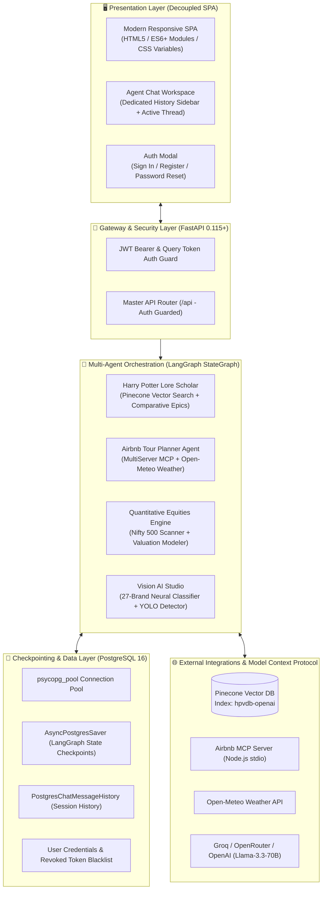
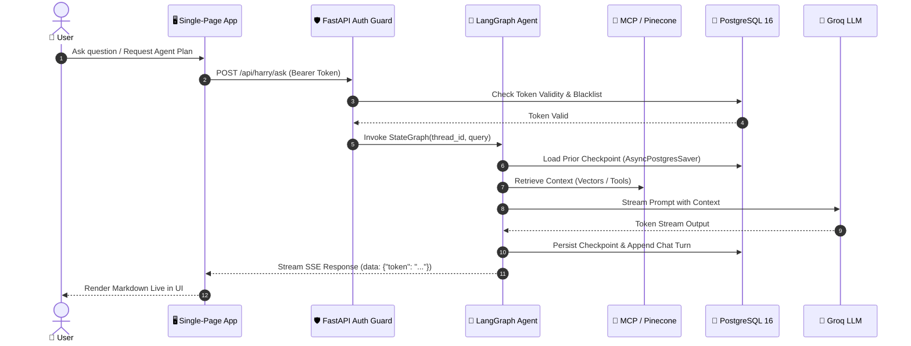

# ⚡ ambideXtrous · Autonomous AI Portfolio & Multi-Agent Intelligence Hub

<p align="center">
  
</p>

<p align="center">
  <a href="https://fastapi.tiangolo.com"></a>
  <a href="https://python.org"></a>
  <a href="https://langchain-ai.github.io/langgraph/"></a>
  <a href="https://www.postgresql.org/"></a>
  <a href="https://www.pinecone.io/"></a>
  <a href="https://jwt.io/"></a>
  <a href="https://modelcontextprotocol.io/"></a>
  <a href="https://docker.com"></a>
  <a href="https://opensource.org/licenses/MIT"></a>
</p>

<p align="center">
  <b>A production-grade, decoupled Multi-Agent AI Platform featuring LangGraph StateGraphs, PostgreSQL state checkpointing, multi-server Model Context Protocol (MCP), Pinecone vector retrieval, JWT authentication, quantitative equity research, and real-time streaming interfaces.</b>
</p>

---

<div align="center">

### 🌐 Live Production Deployments

| Resource | URL | Status |
| :--- | :--- | :--- |
| **Live Production Web App** | [`portfolio-agent-ai.vercel.app`](https://portfolio-agent-ai.vercel.app) | 🟢 `Online` |
| **Interactive OpenAPI Docs** | [`/docs`](https://portfolio-agent-ai.vercel.app/docs) | 🟢 `Public` |
| **Alternative API Specs** | [`/redoc`](https://portfolio-agent-ai.vercel.app/redoc) | 🟢 `Public` |
| **Authentication Guard** | Sign In / Register (All AI features protected) | 🔒 `Enforced` |

</div>

---

## ⚡ Architecture Overview

The system is decoupled into a presentation SPA, an asynchronous FastAPI gateway, LangGraph StateGraph agent execution engines, and a resilient PostgreSQL persistence layer:



---

## 🧩 Key AI Features & Capabilities

| Feature | Tech Stack | Description |
| :--- | :--- | :--- |
| **🪄 Harry Potter Lore Scholar** | LangGraph, Pinecone (`hpvdb-openai`), Groq | RAG agent querying 8,970 vector chunks with comparative Indian Epics synthesis and dedicated session history. |
| **🏡 MCP Tour Planner** | LangGraph, Airbnb MCP Server, Open-Meteo | Live Airbnb stay rate lookup and 3-day weather forecasts streamed token-by-token via Server-Sent Events (SSE). |
| **💾 Postgres Checkpointing** | LangGraph `AsyncPostgresSaver`, PostgreSQL 16 | Real-time thread state serialization, conversation resumption, and session lifecycle management. |
| **🛡️ JWT Authentication Guard** | FastAPI, PyJWT, Argon2id | Strict authentication gating on all AI agent endpoints; public access limited strictly to Home. |
| **📈 Stock Screener & Valuation** | Pandas, Technical Analysis, Valuation Models | 20-DMA volume breakout scanner across Nifty 500/Microcap 250 with automated institutional research reports. |
| **👁️ Vision AI & YOLO Detection** | PyTorch, YOLOv8 | 27-brand corporate logo neural classification with real-time bounding-box coordinates overlay. |
| **🐙 2D Clustering Sandbox** | Scikit-Learn, Plotly.js | Interactive 2D spatial canvas with real-time K-Means, DBSCAN, and Silhouette Coefficient evaluation. |
| **🎙️ Voice AI Agent** | LiveKit WebRTC, Groq, Silero VAD | Low-latency full-duplex conversational voice agent with live audio waveform visualization. |

---

## 🔄 End-to-End Request Dataflow



---

## 📡 Core API Specification

| Domain | Method | Endpoint | Auth | Description |
| :--- | :---: | :--- | :---: | :--- |
| **System** | `GET` | `/api/system/health` | Public | System status and checkpointer mode. |
| **Auth** | `POST` | `/api/auth/signup` | Public | Register new user account. |
| **Auth** | `POST` | `/api/auth/login` | Public | Authenticate and issue JWT Bearer token. |
| **Auth** | `GET` | `/api/auth/me` | 🔒 Bearer | Fetch authenticated user profile. |
| **Auth** | `POST` | `/api/auth/logout` | 🔒 Bearer | Revoke token and add to PostgreSQL blacklist. |
| **Chat** | `GET` | `/api/chat/threads/{id}/history` | 🔒 Bearer | Retrieve thread chat history. |
| **Chat** | `DELETE`| `/api/chat/threads/{id}` | 🔒 Bearer | Delete thread history and checkpoints. |
| **Harry Potter** | `POST` | `/api/harry/ask` | 🔒 Bearer | Lore query with Pinecone retrieval. |
| **Harry Potter** | `GET` | `/api/harry/ask/stream` | 🔒 Bearer | Real-time SSE token stream. |
| **Tour Planner** | `POST` | `/api/tour/plan` | 🔒 Bearer | Airbnb accommodations and travel plan. |
| **Tour Planner** | `GET` | `/api/tour/stream` | 🔒 Bearer | Real-time SSE streaming with MCP tools. |
| **Stock Screener** | `POST` | `/api/stock/scan` | 🔒 Bearer | Volume breakout equity scanner. |
| **Stock Screener** | `GET` | `/api/stock/report` | 🔒 Bearer | Institutional valuation report. |
| **Vision Studio** | `POST` | `/api/vision/classify` | 🔒 Bearer | 27-brand logo classification. |
| **Vision Studio** | `POST` | `/api/vision/yolo` | 🔒 Bearer | YOLO logo bounding box detection. |
| **Clustering** | `POST` | `/api/cluster/run` | 🔒 Bearer | K-Means & DBSCAN with Silhouette scores. |
| **Voice Agent** | `GET` | `/api/voice/status` | 🔒 Bearer | LiveKit room tokens and agent readiness. |

---

## 🚀 Quickstart

### Option A: Docker Compose (Full Stack)

```bash
git clone https://github.com/ambideXtrous9/portfolio-agent.git
cd portfolio-agent
cp .env.example .env

docker compose up -d --build
```

* **Frontend**: `http://localhost:3000`
* **FastAPI Backend**: `http://localhost:8000`
* **API Docs**: `http://localhost:8000/docs`
* **PostgreSQL**: `localhost:5432`

---

### Option B: Local Python Development

```bash
python3 -m venv .venv
source .venv/bin/activate
pip install -r requirements.txt
cp .env.example .env

python run.py
```

---

## 🧪 Integration Verification

Run the end-to-end integration test suite verifying authentication gating, PostgreSQL checkpointing, session isolation, and token blacklisting:

```bash
python3 backend/tests/test_postgres_auth.py
```

> **Result**: 11/11 tests passing (Health, 401 Unauthorized Gating, Signup, Login, Profile, Bearer Auth, Query Token, Chat History, Logout & Revocation).

---

## 📂 Repository Layout

```
portfolio-agent/
├── backend/
│   ├── app/
│   │   ├── main.py                     # FastAPI application & lifespan management
│   │   ├── config.py                   # Pydantic Settings
│   │   ├── core/                       # Auth, DB, LLM factory, MCP client
│   │   ├── schemas/                    # Pydantic validation models
│   │   └── api/endpoints/              # Auth-guarded feature endpoints
│   └── tests/test_postgres_auth.py     # Integration test suite
├── frontend/
│   ├── index.html                      # SPA interface with dedicated chat sidebars
│   ├── css/style.css                   # Streamlit & Obsidian design system
│   ├── js/                             # Authenticated API client & agent view modules
│   └── assets/images/                  # Hero banner, graphs, diagrams
├── docker-compose.yml                  # 3-tier production stack
└── run.py                              # Local dev runner
```

---

## 📄 License & Author

Distributed under the **MIT License**.

* **Author**: Sushovan Saha ([@ambideXtrous9](https://github.com/ambideXtrous9))
* **Repository**: [github.com/ambideXtrous9/portfolio-agent](https://github.com/ambideXtrous9/portfolio-agent)
